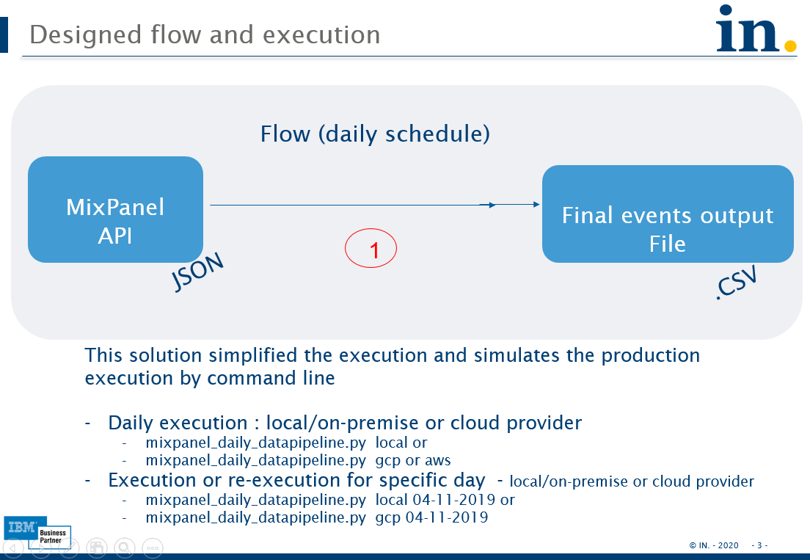
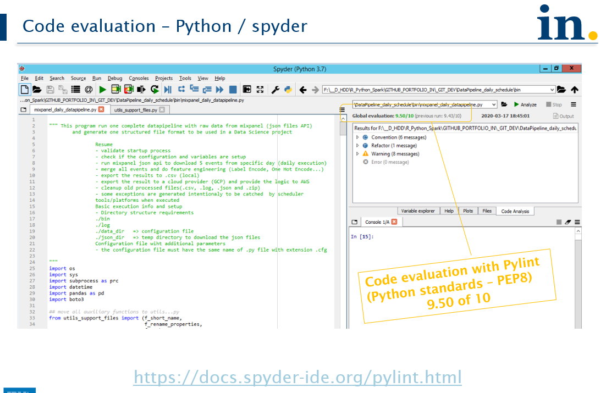
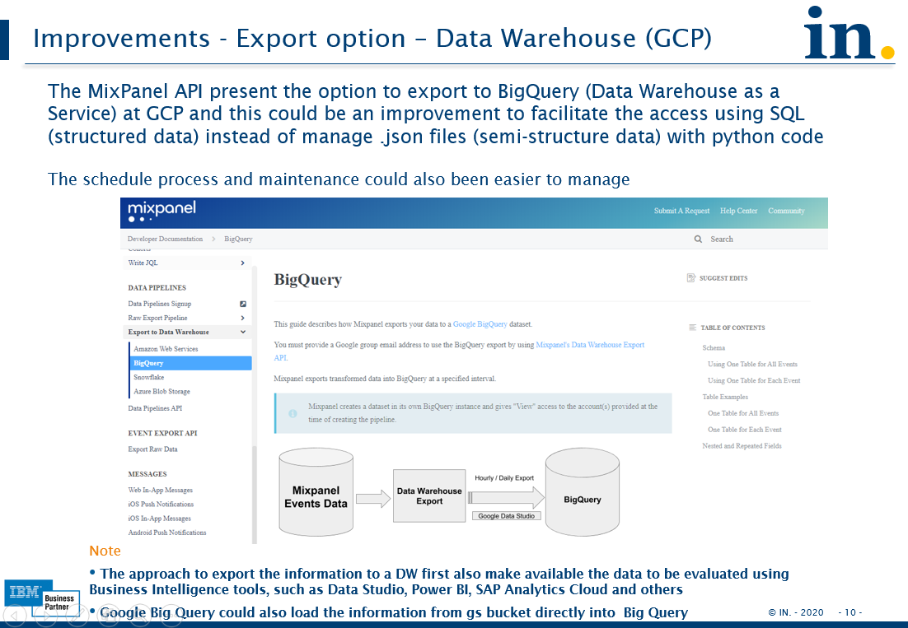
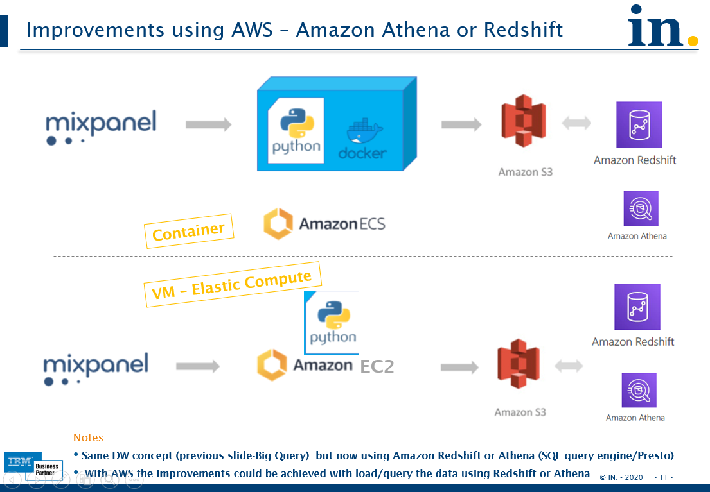

# MixPanel daily data pipeline

This project sample starts with the requirement that need's to run data science projects with all information available at MixPanel

All code and documentation are available at bin/ and doc/ directories
	other directories has the data pipeline results data/ dir, staging and logs dir

### Summary about Mix Panel

### Project solution

### Code analysis - python

### Improvements and Next steps - data pipeline integration with Analytics

#### GCP - Big Query option

#### AWS - Redshift - Athena options

